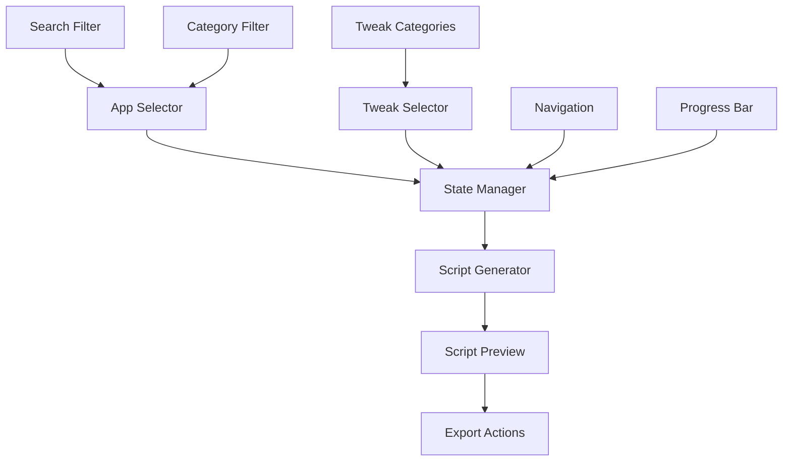

# MacInitiate - System Patterns

## Architecture Overview
MacInitiate follows a **static-first, client-side architecture** that prioritizes reliability, speed, and simplicity. The entire application runs in the browser with no backend dependencies, making it deployable anywhere and immune to server downtime.

## Core Architecture Patterns

### 1. **Static Data Layer**
```typescript
// All apps and tweaks defined as TypeScript interfaces
interface App {
  id: string;
  name: string;
  category: AppCategory;
  source: 'homebrew-cask' | 'mac-app-store' | 'direct';
  packageId: string;
  description: string;
  size?: string;
  version?: string;
  lastUpdated: string;
  alternatives?: string[];
  dependencies?: string[];
}

interface SystemTweak {
  id: string;
  name: string;
  description: string;
  category: TweakCategory;
  defaultValue: boolean;
  command: string;
  requiresRestart: boolean;
  compatibleVersions: string[];
}
```

### 2. **Component-First UI Architecture**
- **App Store Component:** Searchable, filterable grid with category navigation
- **Tweaker Component:** Grouped toggles with real-time preview
- **Generator Component:** Live script preview with copy/download functionality
- **Navigation Component:** Persistent sidebar with progress indicators

### 3. **State Management Pattern**
```typescript
// Centralized state using React Context + useReducer
interface SetupState {
  selectedApps: string[];
  selectedTweaks: string[];
  generatedScript: string;
  currentStep: 'apps' | 'tweaks' | 'generate';
  progress: number;
}

type SetupAction = 
  | { type: 'SELECT_APP'; appId: string }
  | { type: 'DESELECT_APP'; appId: string }
  | { type: 'TOGGLE_TWEAK'; tweakId: string }
  | { type: 'GENERATE_SCRIPT' }
  | { type: 'SET_STEP'; step: SetupState['currentStep'] };
```

## Data Structure Design

### Apps Database Schema
```typescript
// apps.ts - Static app definitions
export const APP_CATEGORIES = {
  DEVELOPMENT: {
    id: 'development',
    name: 'Development',
    subcategories: ['IDEs', 'Terminal', 'Version Control', 'Databases']
  },
  PRODUCTIVITY: {
    id: 'productivity',
    name: 'Productivity',
    subcategories: 'Launchers', 'Automation', 'Notes', 'Communication']
  },
  DESIGN: {
    id: 'design',
    name: 'Design',
    subcategories: ['UI/UX', 'Graphics', 'Prototyping', '3D']
  }
} as const;

export const APPS: App[] = [
  {
    id: 'cursor',
    name: 'Cursor',
    category: 'development',
    subcategory: 'IDEs',
    source: 'homebrew-cask',
    packageId: 'cursor',
    description: 'AI-powered code editor',
    alternatives: ['vscode', 'sublime-text'],
    dependencies: ['git']
  },
  // ... 200+ curated apps
];
```

### System Tweaks Schema
```typescript
// tweaks.ts - System preference definitions
export const TWEAK_CATEGORIES = {
  APPEARANCE: {
    id: 'appearance',
    name: 'Appearance & Display'
  },
  INPUT: {
    id: 'input',
    name: 'Input & Interaction'
  },
  SECURITY: {
    id: 'security',
    name: 'Security & Privacy'
  }
} as const;

export const SYSTEM_TWEAKS: SystemTweak[] = [
  {
    id: 'show-hidden-files',
    name: 'Show Hidden Files in Finder',
    description: 'Display files and folders starting with a dot',
    category: 'appearance',
    defaultValue: false,
    command: 'defaults write com.apple.finder AppleShowAllFiles -bool true',
    requiresRestart: true,
    compatibleVersions: ['>=14.0']
  },
  // ... 100+ system tweaks
];
```

## Script Generation Engine

### Command Builder Pattern
```typescript
class ScriptGenerator {
  private commands: string[] = [];
  
  addHomebrewApps(appIds: string[]): void {
    const apps = APPS.filter(app => appIds.includes(app.id));
    const caskApps = apps.filter(app => app.source === 'homebrew-cask');
    
    if (caskApps.length > 0) {
      this.commands.push('# Install Homebrew Cask Apps');
      this.commands.push(`brew install --cask ${caskApps.map(app => app.packageId).join(' ')}`);
    }
  }
  
  addMacAppStoreApps(appIds: string[]): void {
    const masApps = APPS.filter(app => appIds.includes(app.id) && app.source === 'mac-app-store');
    
    if (masApps.length > 0) {
      this.commands.push('# Install Mac App Store Apps');
      this.commands.push(`mas install ${masApps.map(app => app.packageId).join(' ')}`);
    }
  }
  
  addSystemTweaks(tweakIds: string[]): void {
    const tweaks = SYSTEM_TWEAKS.filter(tweak => tweakIds.includes(tweak.id));
    
    if (tweaks.length > 0) {
      this.commands.push('# Apply System Preferences');
      tweaks.forEach(tweak => {
        this.commands.push(`# ${tweak.name}`);
        this.commands.push(tweak.command);
      });
    }
  }
  
  generate(): string {
    return [
      '#!/bin/bash',
      'set -e',  # Exit on error
      '',
      '# MacInitiate Generated Setup Script',
      `# Generated on ${new Date().toISOString()}`,
      '',
      ...this.commands,
      '',
      'echo "Setup complete! Restart your machine to apply all changes."'
    ].join('\n');
  }
}
```

## Component Relationships



## Critical Implementation Paths

### 1. **Selection to Script Generation**
1. User selects apps/tweaks
2. State updates via Context reducer
3. ScriptGenerator receives current selections
4. Commands built and optimized
5. Script rendered in preview component

### 2. **Search and Filtering**
1. Search query triggers filter function
2. Apps filtered by name, description, tags
3. Category filters applied
4. Results sorted by relevance/popularity
5. UI updates with filtered list

### 3. **Export and Validation**
1. Script generated and syntax-checked
2. Dependencies resolved and ordered
3. Export options presented (copy/download)
4. Error handling for invalid selections
5. Success feedback and next steps
