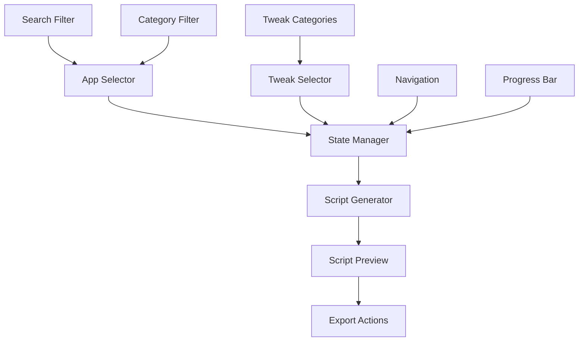

# MacInitiate - System Patterns

## Architecture Overview
MacInitiate follows a **developer-first, viral-growth architecture** that prioritizes rapid user acquisition, team collaboration, and recurring revenue. The platform combines static reliability with dynamic social features, creating a moat through community-driven templates and team configuration management.

## Core Architecture Patterns

### 1. **Template-First Data Layer**
```typescript
// Role-based templates for viral growth
interface DeveloperTemplate {
  id: string;
  name: string;
  role: 'frontend' | 'backend' | 'fullstack' | 'devops' | 'mobile';
  description: string;
  apps: string[]; // App IDs
  tweaks: string[]; // Tweak IDs
  popularity: number;
  author: string;
  isVerified: boolean;
}

// Enhanced app schema with developer focus
interface App {
  id: string;
  name: string;
  category: DeveloperCategory;
  role: Role[]; // Frontend, Backend, etc.
  source: 'homebrew-cask' | 'direct-download' | 'mac-app-store';
  packageId: string;
  description: string;
  longDescription: string;
  size: string;
  installOrder: number;
  dependencies: string[];
  alternatives: string[];
  popularity: number;
  isDevTool: boolean;
  commandLineTools: string[];
  fileAssociations: string[];
}

type DeveloperCategory = 
  | 'development' 
  | 'productivity' 
  | 'communication' 
  | 'browsers'
  | 'utilities';
```

### 2. **Viral Component Architecture**
- **Template Selector:** Role-based one-click setups with social proof
- **App Store Component:** Developer-focused catalog with role filtering
- **Tweak Selector:** Developer-optimized system preferences
- **Social Sharing Component:** "My Setup" profiles and configuration sharing
- **Team Management Component:** Enterprise-grade setup deployment
- **Script Generator Component:** Multi-source package management

### 3. **State Management with Social Features**
```typescript
// Enhanced state for viral features
interface SetupState {
  selectedApps: string[];
  selectedTweaks: string[];
  selectedTemplate?: string;
  generatedScript: string;
  currentStep: 'welcome' | 'templates' | 'apps' | 'tweaks' | 'generate' | 'share';
  progress: number;
  userProfile?: UserProfile;
  teamConfig?: TeamConfiguration;
}

interface UserProfile {
  id: string;
  name: string;
  githubUsername?: string;
  setupHistory: SavedSetup[];
  sharedSetups: string[];
  followers: number;
  following: number;
}

interface TeamConfiguration {
  id: string;
  name: string;
  memberCount: number;
  requiredApps: string[];
  requiredTweaks: string[];
  adminUsers: string[];
  createdAt: Date;
}
```

## Data Structure Design

### Developer-Focused Apps Database Schema
```typescript
// apps.ts - Developer-curated app definitions
export const DEVELOPER_CATEGORIES = {
  DEVELOPMENT: {
    id: 'development',
    name: 'Development Tools',
    subcategories: ['IDEs', 'Terminal', 'Version Control', 'Databases', 'API Testing'],
    icon: '💻'
  },
  PRODUCTIVITY: {
    id: 'productivity', 
    name: 'Developer Productivity',
    subcategories: ['Launchers', 'Notes', 'Automation', 'Window Management'],
    icon: '⚡'
  },
  COMMUNICATION: {
    id: 'communication',
    name: 'Team Communication', 
    subcategories: ['Chat', 'Video', 'Collaboration'],
    icon: '💬'
  },
  BROWSERS: {
    id: 'browsers',
    name: 'Developer Browsers',
    subcategories: ['Primary', 'Secondary', 'Development'],
    icon: '🌐'
  },
  UTILITIES: {
    id: 'utilities',
    name: 'System Utilities', 
    subcategories: ['Security', 'System Tools', 'File Management'],
    icon: '🛠️'
  }
} as const;

// Priority apps for immediate implementation
export const PRIORITY_APPS: App[] = [
  // Development Core
  {
    id: 'vscode',
    name: 'Visual Studio Code',
    category: DEVELOPMENT,
    role: ['frontend', 'backend', 'fullstack'],
    source: 'homebrew-cask',
    packageId: 'visual-studio-code',
    description: 'Free source-code editor made by Microsoft',
    popularity: 95,
    installOrder: 1,
    isDevTool: true
  },
  {
    id: 'cursor',
    name: 'Cursor', 
    category: DEVELOPMENT,
    role: ['frontend', 'backend', 'fullstack'],
    source: 'homebrew-cask',
    packageId: 'cursor',
    description: 'AI-powered code editor',
    popularity: 75,
    installOrder: 1,
    isDevTool: true
  },
  {
    id: 'warp',
    name: 'Warp',
    category: DEVELOPMENT,
    role: ['backend', 'devops', 'fullstack'],
    source: 'homebrew-cask', 
    packageId: 'warp',
    description: 'AI-powered terminal',
    popularity: 80,
    installOrder: 2,
    isDevTool: true
  },
  // Productivity Essentials
  {
    id: 'raycast',
    name: 'Raycast',
    category: PRODUCTIVITY,
    role: ['frontend', 'backend', 'fullstack', 'devops'],
    source: 'homebrew-cask',
    packageId: 'raycast',
    description: 'Productivity launcher and search',
    popularity: 75,
    installOrder: 11,
    isDevTool: false
  },
  {
    id: '1password', 
    name: '1Password',
    category: UTILITIES,
    role: ['frontend', 'backend', 'fullstack', 'devops'],
    source: 'homebrew-cask',
    packageId: '1password',
    description: 'Password manager and secure wallet',
    popularity: 85,
    installOrder: 35,
    isDevTool: false
  }
  // ... 10 more priority apps
];
```

### Role-Based Template System
```typescript
// templates.ts - Viral growth templates
export const DEVELOPER_TEMPLATES: DeveloperTemplate[] = [
  {
    id: 'frontend-starter',
    name: 'Frontend Developer',
    role: 'frontend',
    description: 'Perfect setup for modern frontend development with React, Vue, or Angular',
    apps: ['vscode', 'chrome', 'figma', 'postman', 'raycast', '1password'],
    tweaks: ['show-hidden-files', 'fast-key-repeat', 'dark-mode-menubar', 'show-file-extensions'],
    popularity: 89,
    author: 'MacInitiate Team',
    isVerified: true
  },
  {
    id: 'backend-starter', 
    name: 'Backend Developer',
    role: 'backend',
    description: 'Optimized for backend development with databases, APIs, and terminal tools',
    apps: ['vscode', 'warp', 'docker', 'tableplus', 'postman', '1password'],
    tweaks: ['show-hidden-files', 'enable-zsh-shell', 'disable-natural-scrolling', 'auto-hide-dock'],
    popularity: 92,
    author: 'MacInitiate Team',
    isVerified: true
  },
  {
    id: 'fullstack-productivity',
    name: 'Fullstack Developer',
    role: 'fullstack', 
    description: 'Complete setup for fullstack developers needing both frontend and backend tools',
    apps: ['cursor', 'warp', 'docker', 'postman', 'tableplus', 'raycast', '1password', 'rectangle'],
    tweaks: ['show-hidden-files', 'fast-key-repeat', 'auto-hide-dock', 'show-path-bar'],
    popularity: 95,
    author: 'MacInitiate Team',
    isVerified: true
  },
  {
    id: 'devops-engineer',
    name: 'DevOps Engineer',
    role: 'devops',
    description: 'Specialized for DevOps with container management and monitoring tools', 
    apps: ['vscode', 'warp', 'docker', 'postman', 'rectangle', '1password'],
    tweaks: ['show-hidden-files', 'enable-zsh-shell', 'disable-dashboard', 'firewall-stealth'],
    popularity: 78,
    author: 'MacInitiate Team',
    isVerified: true
  }
];
```

### System Tweaks Schema
```typescript
// tweaks.ts - System preference definitions
export const TWEAK_CATEGORIES = {
  APPEARANCE: {
    id: 'appearance',
    name: 'Appearance & Display'
  },
  INPUT: {
    id: 'input',
    name: 'Input & Interaction'
  },
  SECURITY: {
    id: 'security',
    name: 'Security & Privacy'
  }
} as const;

export const SYSTEM_TWEAKS: SystemTweak[] = [
  {
    id: 'show-hidden-files',
    name: 'Show Hidden Files in Finder',
    description: 'Display files and folders starting with a dot',
    category: 'appearance',
    defaultValue: false,
    command: 'defaults write com.apple.finder AppleShowAllFiles -bool true',
    requiresRestart: true,
    compatibleVersions: ['>=14.0']
  },
  // ... 100+ system tweaks
];
```

## Script Generation Engine

### Command Builder Pattern
```typescript
class ScriptGenerator {
  private commands: string[] = [];
  
  addHomebrewApps(appIds: string[]): void {
    const apps = APPS.filter(app => appIds.includes(app.id));
    const caskApps = apps.filter(app => app.source === 'homebrew-cask');
    
    if (caskApps.length > 0) {
      this.commands.push('# Install Homebrew Cask Apps');
      this.commands.push(`brew install --cask ${caskApps.map(app => app.packageId).join(' ')}`);
    }
  }
  
  addMacAppStoreApps(appIds: string[]): void {
    const masApps = APPS.filter(app => appIds.includes(app.id) && app.source === 'mac-app-store');
    
    if (masApps.length > 0) {
      this.commands.push('# Install Mac App Store Apps');
      this.commands.push(`mas install ${masApps.map(app => app.packageId).join(' ')}`);
    }
  }
  
  addSystemTweaks(tweakIds: string[]): void {
    const tweaks = SYSTEM_TWEAKS.filter(tweak => tweakIds.includes(tweak.id));
    
    if (tweaks.length > 0) {
      this.commands.push('# Apply System Preferences');
      tweaks.forEach(tweak => {
        this.commands.push(`# ${tweak.name}`);
        this.commands.push(tweak.command);
      });
    }
  }
  
  generate(): string {
    return [
      '#!/bin/bash',
      'set -e',  # Exit on error
      '',
      '# MacInitiate Generated Setup Script',
      `# Generated on ${new Date().toISOString()}`,
      '',
      ...this.commands,
      '',
      'echo "Setup complete! Restart your machine to apply all changes."'
    ].join('\n');
  }
}
```

## Component Relationships



## Critical Implementation Paths

### 1. **Selection to Script Generation**
1. User selects apps/tweaks
2. State updates via Context reducer
3. ScriptGenerator receives current selections
4. Commands built and optimized
5. Script rendered in preview component

### 2. **Search and Filtering**
1. Search query triggers filter function
2. Apps filtered by name, description, tags
3. Category filters applied
4. Results sorted by relevance/popularity
5. UI updates with filtered list

### 3. **Export and Validation**
1. Script generated and syntax-checked
2. Dependencies resolved and ordered
3. Export options presented (copy/download)
4. Error handling for invalid selections
5. Success feedback and next steps
